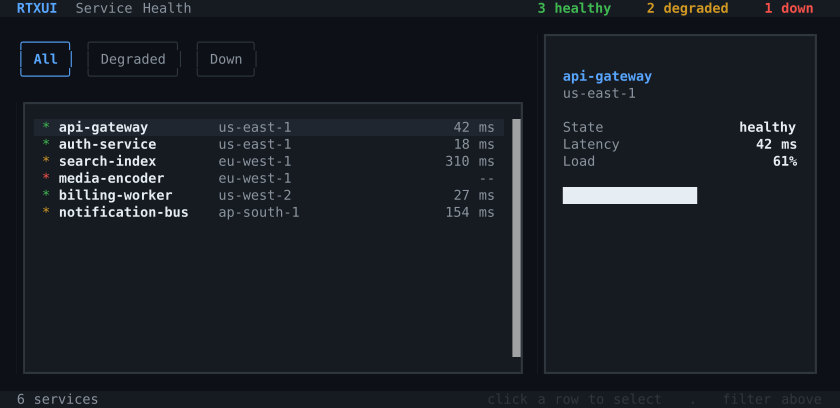

# RTXUI — Reactive Terminal User Interfaces for C++

[](https://github.com/ArthurSonzogni/RTXUI/actions/workflows/test.yml)
[](https://github.com/ArthurSonzogni/RTXUI/actions/workflows/shared.yml)
[](https://arthursonzogni.github.io/RTXUI/)
[](https://arthursonzogni.github.io/RTXUI/#interactive-playground)
[](LICENSE)
[](https://en.cppreference.com/w/cpp/23)

**RTXUI** brings the browser's declarative rendering pipeline to modern C++.

Structure interfaces with semantic HTML. Style them with real CSS (flexbox, grid, cascade, and transitions). Bind plain C++ state; mutate a variable and the engine diffs the DOM and repaints the terminal.

*From the creator of [FTXUI](https://github.com/ArthurSonzogni/FTXUI).*

<p align="center">
  
</p>

<p align="center">
  <a href="https://arthursonzogni.github.io/RTXUI/#interactive-playground">
    
  </a>
</p>

<p align="center">
  <em>
    <a href="example/app_dashboard.cpp">example/app_dashboard.cpp</a> —
    flexbox, a bound collection, computed values, conditional rendering and
    transitions, in one file.
    Regenerate with <code>tools/ansi_to_svg.py</code>.
  </em>
</p>

---

## ⚡ Quickstart

A complete, reactive counter with CSS hover styling and live hot reloading in under 30 lines:

```cpp
// main.cpp
#include <rtxui/rtxui.hpp>

class CounterApp : public rtxui::Component<CounterApp> {
 public:
  int count = 0;
  void Increment() { count++; }

  std::string_view view = R"html(
    <div class="card">
      <h1>Count: {count}</h1>
      <button onclick="Increment">Increment</button>
    </div>
    <style>
      .card {
        border: round;
        border-color: cyan;
        padding: 1 2;
      }

      h1 {
        color: yellow;
        margin-bottom: 1;
      }

      button {
        border: solid;
        border-color: gray;
        padding: 0 1;
        transition: all 0.2s ease;
      }

      button:hover,
      button:focus {
        border-color: green;
        color: green;
      }
    </style>
  )html";

  CounterApp() {
    Bind(count);
    Bind(Increment);
    EnableHotReload();
  }
};

int main() {
  auto app = rtxui::Ref<CounterApp>::New();
  rtxui::Screen screen(app);
  screen.Loop();
  return 0;
}
```

### Add to your `CMakeLists.txt`

```cmake
cmake_minimum_required(VERSION 3.24)
project(my_app LANGUAGES CXX)

set(CMAKE_CXX_STANDARD 23)
set(CMAKE_CXX_STANDARD_REQUIRED ON)

include(FetchContent)
FetchContent_Declare(
  rtxui
  GIT_REPOSITORY https://github.com/ArthurSonzogni/RTXUI.git
  GIT_TAG        main # Or pin a release tag
)
FetchContent_MakeAvailable(rtxui)

add_executable(my_app main.cpp)
# Link against `rtxui` (not rtxui_lib) to preserve static element registrations
target_link_libraries(my_app PRIVATE rtxui)
```

Build and run:
```bash
cmake -B build -G Ninja && cmake --build build
./build/my_app
```

---

## 🌟 Key Features

*   **HTML & CSS in C++:** Semantic HTML tags styled with standard CSS. Full support for flexbox, grid, cascade specificity, pseudo-classes (`:hover`, `:focus`, `:active`), and transitions.
*   **Reactive State Binding:** Bind C++ member variables and callbacks directly to template tokens (`{count}`, `onclick="Increment"`). Mutating state triggers surgical DOM diffing and repaints.
*   **🔥 Live Template Hot Reloading:** Call `EnableHotReload()`. Edit your HTML/CSS templates in your editor and watch the running terminal UI update **in <10ms without recompiling** or restarting.
*   **WebAssembly Ready:** Compile the exact same codebase to WebAssembly with Emscripten to run full-speed in modern web browsers.
*   **Spatial Navigation & Focus:** Built-in sequential Tab cycling, dynamic Arrow-key spatial navigation, and mouse event routing.
*   **Zero External Dependencies:** Clean, self-contained modern C++23 engine with no runtime dependencies beyond the standard library.

---

## RTXUI or FTXUI?

Both libraries are created and maintained by the same author. They explore fundamentally different architectural bets:

*   **FTXUI** composes interfaces through direct C++ functional calls (`hbox(...)`, `vbox(...)`, `border(...)`). It is mature, compact, type-checked at compile time, and supports Windows.
    *   *Choose FTXUI* when you need Windows support, a tiny binary footprint, or a minimal functional C++ API without a runtime parsing engine.
*   **RTXUI** executes a browser-style declarative pipeline. Templates are HTML literals, styles follow the CSS cascade, and state changes flow reactively into a diffed DOM.
    *   *Choose RTXUI* when you think in web layouts, want CSS flexbox/grid, want instant hot-reloading of layouts during development, or want identical TUIs to deploy both in terminal and via WebAssembly. Requires Linux/macOS and C++23.

---

## 🛠️ Building & Contributing

### Compiler Prerequisites

RTXUI requires a **C++23** compiler (GCC 14+ or Clang 18+) and **CMake 3.24+** with **Ninja**.

*   **Debian / Ubuntu:**
    ```bash
    sudo apt install g++-14 ninja-build cmake
    ```
*   **Fedora:**
    ```bash
    sudo dnf install gcc-c++ ninja-build cmake
    ```
*   **Arch Linux:**
    ```bash
    sudo pacman -S gcc ninja cmake
    ```
*   **macOS (Homebrew):**
    ```bash
    brew install ninja cmake
    # Uses Apple Clang (Xcode 16+) or GCC from Homebrew (brew install gcc)
    ```

### Build & Run Tests

```bash
# Configure and compile with Ninja
cmake -B build -G Ninja -DCMAKE_BUILD_TYPE=Release -DRTXUI_BUILD_EXAMPLES=ON -DRTXUI_BUILD_TESTS=ON
cmake --build build

# Run automated unit tests & smoke checks
ctest --test-dir build --output-on-failure

# Run any example directly:
./build/rtxui_example_demo
./build/rtxui_example_app_dashboard
```

---

## 🤝 Contributing

Contributions are welcome! Please read the [Contributing Guide](CONTRIBUTING.md) for coding standards (Chromium style, no `try/catch`, mandatory regression tests) and formatting instructions.

## 📄 License

Distributed under the MIT License. See [LICENSE](LICENSE) for details.

