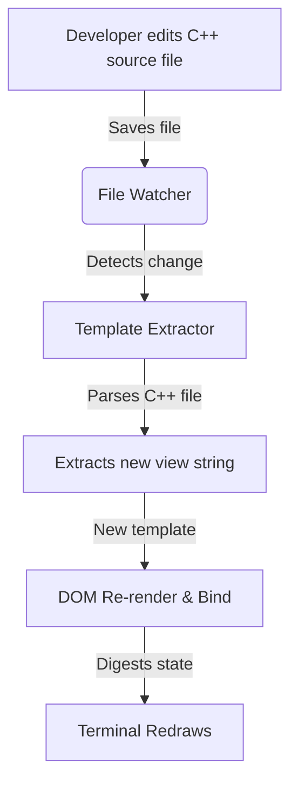

# Live HTML/CSS Hot-Reloading

RTXUI offers a developer mode that extracts and updates HTML templates and CSS styles from C++ source files in real-time, refreshing the active terminal interface in under 10ms without recompilation.

---

## How It Works

By utilizing modern C++20 `std::source_location`, RTXUI tracks which C++ source file and which member variable contains your component's HTML template (`view`). When the file is saved in your editor, a file watcher extracts the modified string literal and updates the live DOM subtree.



---

## Basic Usage

To enable hot-reloading for a component, call `EnableHotReload()` in its constructor.

```cpp
#include <rtxui/rtxui.hpp>

class MyPanel : public rtxui::Component<MyPanel> {
 public:
  std::string_view view = R"html(
    <div class="panel">
      <h1>Live Panel</h1>
      <p>Modify this text, save the file, and watch the terminal update!</p>
    </div>
    <style>
      .panel {
        border: heavy;
        border-color: rgb(59, 130, 246);
        padding: 1;
      }
      h1 { color: rgb(234, 179, 8); }
    </style>
  )html";

  MyPanel() {
    // Automatically binds the file location and "view" variable
    EnableHotReload();
  }
};
```

---

## Enabling Developer Mode

To avoid overhead in production, hot-reloading is conditionally compiled. Ensure you define `RTXUI_DEV_MODE` during compilation or set the appropriate CMake option.

### CMake Configuration
Add the dev mode definition in your development build:
```cmake
target_compile_definitions(my_app PRIVATE RTXUI_DEV_MODE)
```

---

## Best Practices & Limitations

*   **HTML/CSS only**: Only changes to HTML markup and `<style>` blocks inside raw string literals can be hot-reloaded. 
*   **No Logic Recompilation**: Modifying C++ methods, bindings, event handlers, or member variables still requires a standard build compilation.
*   **Variable Names**: By default, `EnableHotReload()` assumes your template is stored in a member variable named `view`. If you use a different variable name, pass it as a string argument:
    ```cpp
    EnableHotReload("my_custom_view");
    ```
