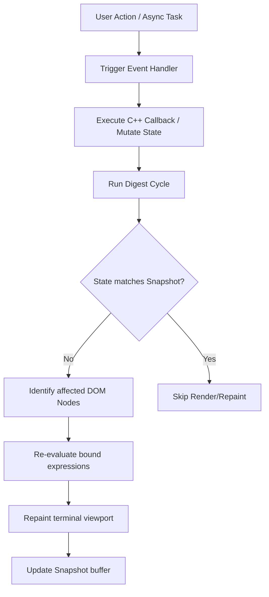

# Component Reactivity & Change Detection

RTXUI uses compile-time reflection to bind C++ variables directly into your XML/HTML templates. This provides transparent, type-safe two-way data binding and change detection without the overhead of heavy runtime wrapper libraries.

---

## 1. Defining a Reactive Component

Components inherit from `rtxui::Component<YourClass>`. Any standard C++ data member can be registered as reactive state, and `const` member functions serve as computed fields.

```cpp
#include <rtxui/rtxui.hpp>

class CounterComponent : public rtxui::Component<CounterComponent> {
 public:
  // State variables
  int count = 0;
  std::string label = "Clicks";

  // Computed state
  int double_count() const { return count * 2; }

  // Callback action
  void Increment() {
    count++;
  }

  // Component layout template
  std::string_view view = R"html(
    <div class="panel">
      <span>{label}: {count}</span>
      <span>Double count: {double_count}</span>
      <button onclick="Increment">Increment</button>
    </div>
  )html";

  // Register variables and functions for template data-binding
  CounterComponent() {
    Bind(count);
    Bind(label);
    Bind(double_count);
    Bind(Increment);
  }
};
```

---

## 2. Compile-Time Reflection & Binding

By inheriting from `rtxui::Component<Derived>` (via the Curiously Recurring Template Pattern), the framework gains type-safe access to your component's fields and methods at compile-time. When you call `Bind(member)`, RTXUI associates the variable with its named expression string inside the template.

### 🔮 The Future: Zero-Boilerplate Auto-Binding via C++26 Reflection

Currently, developers call `Bind(member)` in the constructor to register fields. This is a temporary necessity because modern compilers are still implementing the standard C++26 reflection proposal.

RTXUI is designed natively for **C++26 reflection** (utilizing the `<meta>` header). If your compiler supports standard C++26 reflection (and defines `RTXUI_HAS_REFLECTION`), the framework automatically inspects your component structure at compile-time:
* **Automatic State Discovery**: Automatically discovers and registers all non-static member variables as state.
* **Automatic Callbacks**: Binds member functions and computed properties directly.

Once C++26 toolchains are fully mature, **manually calling `Bind()` will no longer be necessary**. Your components will require zero boilerplate:

```cpp
class FutureCounter : public rtxui::Component<FutureCounter> {
 public:
  int count = 0; // Automatically bound!
  
  void Increment() { count++; } // Automatically bound!

  std::string_view view = R"html(
    <button onclick="Increment">Clicks: {count}</button>
  )html";

  // No constructor or Bind() calls needed!
};
```

---

## 3. The Change Detection Loop (Snapshot Reactivity)

To ensure high rendering performance without forcing developers to use custom observable wrappers (like signals or reactive ref types), RTXUI utilizes a highly optimized snapshot-based change detection cycle:



1. **State Snapshot**: When the component is mounted, RTXUI takes a bitwise copy of all bound member fields and stores them in an internal snapshot buffer.
2. **Digest Cycle**: When an interaction event occurs (such as a keypress, button click, or a thread callback scheduling a task), the main rendering loop runs `Digest()`.
3. **Optimized Comparison**: The engine performs quick member-by-member comparisons between current runtime state and the snapshot.
4. **Targeted DOM Updates**: If a state change is detected:
    * The engine determines precisely which nodes in the DOM tree depend on that specific state variable.
    * Only those affected text elements or styling attributes are updated and scheduled for repainting.
    * The snapshot buffer is updated to match the new state.

---

## 4. Parent-Child Communication (Component Properties)

To pass properties (or "props") from a parent component down to a child, declare a public nested structure named `Props` inside the child class.

### Child Definition
```cpp
class TodoItem : public rtxui::Component<TodoItem> {
 public:
  struct Props {
    std::string task_text;
    bool completed = false;
  } props;

  std::string completion_class() const {
    return props.completed ? "done" : "";
  }

  std::string_view view = R"html(
    <div class="todo-row">
      <span class="{completion_class}">{props.task_text}</span>
    </div>
  )html";

  TodoItem() {
    Bind(props.task_text);
    Bind(props.completed);
    Bind(completion_class);
  }
};
```

### Parent Usage
The parent component can pass dynamic expressions directly to the child's properties in its template:

```html
<TodoItem props.task_text="{item.text}" props.completed="{item.done}" />
<!-- Shorthand syntax is also supported: -->
<TodoItem task_text="{item.text}" completed="{item.done}" />
```

During parent rendering:
1. The parent evaluates the bound expressions in the parent component's context.
2. The evaluated values are parsed, typed, and mapped directly to the child component's `props` member variables.
3. The child's change detection detects the updated props and refreshes the child view.

---

<ExampleTabs src="/wasm/rtxui_example_demo.js">
<template #source>

<<< @/../example/demo.cpp

</template>
</ExampleTabs>
